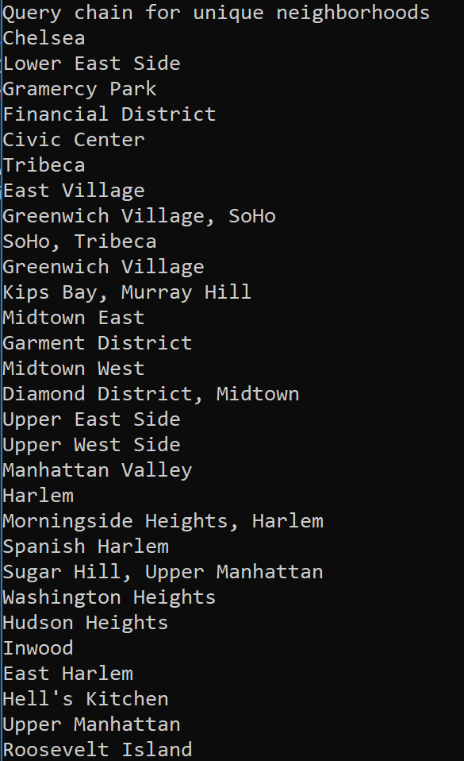

# Lab 8 LINQ

This project deserializes JSON into an object. The user can then utilize LINQ queries to read/manipulate data.

## Getting Started

Open the project with Visual Studio, and run (Ctrl + F5). 

Alternatively, you can navigate to project directory containing Program.cs file with PowerShell, then do the following.

 ```
 dotnet run
 ```

 ## Visual

 